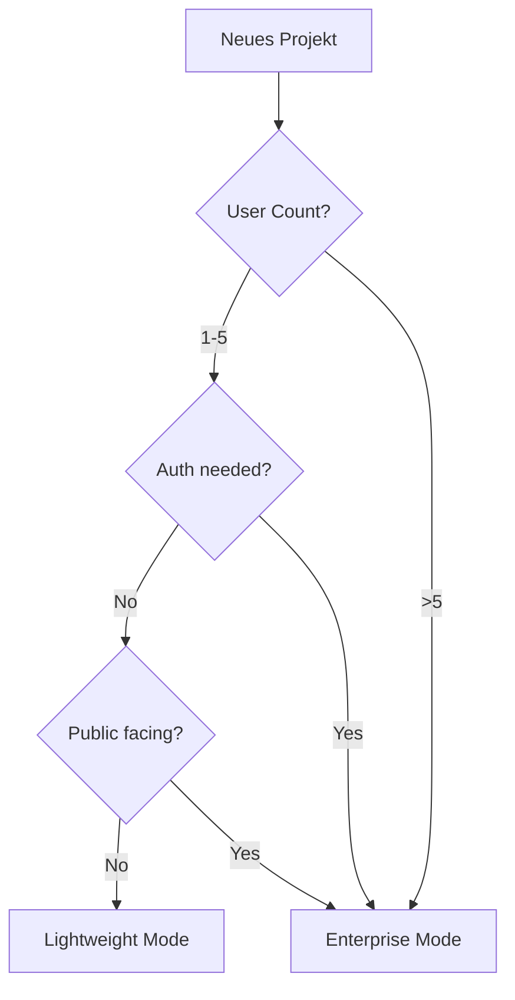

# Lightweight Mode - Framework v1.3

## 🚀 Pragmatic Software Development für kleine Projekte

### **Wann Lightweight Mode verwenden?**

Der Lightweight Mode ist optimiert für:
- **Persönliche Tools & Utilities**
- **Proof-of-Concepts & Prototypen**
- **Single-User Anwendungen**
- **Interne Team-Tools (< 5 User)**
- **Hobby-Projekte & Experimente**

### **Aktivierung des Lightweight Mode**

In Phase 1, direkt nach Projektname-Eingabe:

```markdown
## Project Complexity Assessment
**Projektname:** MeinTool
**Complexity:** [x] Lightweight [ ] Enterprise
**User Count:** 1-3
**Auth Required:** No
**Deployment:** Local/Private
```

### **Automatische Vereinfachungen**

#### ❌ **Wird automatisch entfernt:**
- ROI-Berechnungen und Business Case Analysen
- Multi-User Authentication & Authorization Systeme
- Rollenbasierte Zugriffsrechte (RBAC)
- Horizontale Skalierungs-Konzepte
- Compliance & Regulatory Requirements
- Umfangreiches Stakeholder-Mapping
- Enterprise Security Features (OAuth, SSO, 2FA)
- High-Availability & Disaster Recovery
- API-Rate-Limiting & Quotas
- Load-Balancing & Caching-Strategien
- Umfangreiche Monitoring-Infrastruktur
- Formal Change Management Prozesse

#### ✅ **Bleibt erhalten (Core-Essentials):**
- **Debug & Logging:** Strukturierte Fehlersuche
- **Error-Handling:** Robuste Fehlerbehandlung
- **Basic Testing:** Kritische Funktionen testen
- **Input-Validation:** Basis-Sicherheit
- **Clean Code:** Wartbarer, lesbarer Code
- **Git-Integration:** Versionskontrolle
- **Basic Documentation:** README & Code-Comments
- **Local Deployment:** Einfache Installation

### **Zeitersparnis-Matrix**

| Phase | Standard Mode | Lightweight Mode | Ersparnis |
|-------|--------------|-----------------|-----------|
| Phase 1 | 15 Min | 5 Min | 67% |
| Phase 2 | 30 Min | 10 Min | 67% |
| Phase 3 | 45 Min | 15 Min | 67% |
| Phase 4 | 60 Min | 20 Min | 67% |
| Phase 5 | 45 Min | 15 Min | 67% |
| Phase 6 | 90 Min | 30 Min | 67% |
| Phase 7 | 30 Min | 10 Min | 67% |
| **Gesamt** | **~6 Stunden** | **~2 Stunden** | **67%** |

### **Tech-Stack Auto-Selection**

#### Lightweight Default Stack:
```yaml
Frontend:
  - HTML5 + Vanilla JavaScript
  - Simple CSS (no framework)
  - LocalStorage für Persistenz

Backend:
  - Python Flask (minimal)
  - SQLite Database
  - File-based configuration

Deployment:
  - Single executable/script
  - Docker container (optional)
  - No cloud services required
```

### **Vereinfachte Quality Gates**

#### Lightweight Quality Checks:
1. **Funktioniert es?** → Basic Smoke Test
2. **Ist es stabil?** → Keine kritischen Crashes
3. **Ist es nutzbar?** → User kann Hauptfunktion ausführen
4. **Ist es dokumentiert?** → README mit Start-Anleitung

### **Pragmatic Shortcuts**

#### Phase-Optimierungen:

**Phase 1 - Setup (5 Min):**
- Skip: Umfangreiche Marktanalyse
- Focus: Was soll das Tool machen?

**Phase 2 - Kickoff (10 Min):**
- Skip: Stakeholder-Interviews
- Focus: Direkte User Story

**Phase 3 - Domain (15 Min):**
- Skip: Umfassende Recherche
- Focus: Kern-Funktionalität

**Phase 4 - Requirements (20 Min):**
- Skip: Detaillierte NFRs
- Focus: Must-Have Features

**Phase 5 - Architecture (15 Min):**
- Skip: Skalierungskonzepte
- Focus: Simple, working solution

**Phase 6 - Implementation (30 Min):**
- Skip: 100% Test Coverage
- Focus: Core functionality works

**Phase 7 - Handover (10 Min):**
- Skip: Umfangreiche Dokumentation
- Focus: "How to run it"

### **Decision-Tree für Mode-Selection**



### **Migration Path**

Lightweight → Enterprise möglich:
1. Start mit Lightweight für MVP
2. Validiere Konzept
3. Upgrade zu Enterprise wenn erfolgreich
4. Incremental Feature Addition

### **Common Use Cases**

#### ✅ **Perfekt für Lightweight:**
- Personal Dashboard
- Team Meeting Timer
- File Converter Tool
- Simple Calculator
- Note-Taking App
- Local Data Analyzer

#### ❌ **Requires Enterprise:**
- E-Commerce Platform
- Banking Application
- Multi-Tenant SaaS
- Public API Service
- Healthcare System
- Government Portal